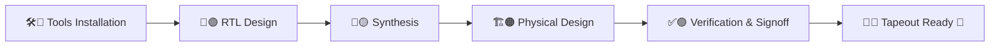

# RISC-V-SoC-Tapeout-Journey-From-RTL-Input-to-Silicon-Output

 

## 👋 Welcome

This repository documents **my personal journey through the RISC-V SoC Tapeout Program (VSD)**.
Here, I record my **week-by-week progress**, from setting up tools, to RTL design, to synthesis, physical design and finally preparing a **tapeout-ready SoC**.

> *“Learning to design a System-on-Chip (SoC) from basic RTL to GDSII using open-source tools — part of India’s largest collaborative RISC-V tapeout initiative, empowering 3500+ participants to build silicon and advance the nation’s semiconductor ecosystem.”*

 

## 🎯 Program Flow: From Idea → Silicon

 

## 🛠️ Tools & Skills

 

## 🌟 Program Objectives & Scope

| Aspect                    | Details                                                                             |
| ------------------------- | ----------------------------------------------------------------------------------- |
| 🎓 **Learning Path**      | End-to-end SoC Design covering RTL → Synthesis → Physical Design → Tapeout          |
| 🛠️ **Tools Ecosystem**   | Open-source EDA stack (Icarus Verilog, Yosys, OpenLane, Magic, KLayout, Sky130 PDK) |
| 🏭 **Industry Relevance** | Mimics real-world semiconductor design methodologies & tapeout flows                |
| 🤝 **Collaboration**      | Contributing alongside 3500+ participants in India’s largest RISC-V SoC initiative  |
| 📈 **Scalability**        | Practical exposure to handling designs that scale from RTL to physical layout       |
| 🇮🇳 **National Impact**  | Strengthening India’s semiconductor design and VLSI ecosystem                       |

 

## 📅 **Week 0 — Foundation & Tools Setup**

<b>🛠️ Week 0: Installing & Configuring the EDA Toolchain</b>

 
  
Week 0 was all about **preparing the sandbox**: installing, verifying and configuring the open-source EDA environment that powers the RTL-to-GDSII flow.

* Installed and verified **Icarus Verilog**, **Yosys**, **GTKWave**.
* Explored **environment setup** for RTL simulation and synthesis.
* Prepared my system for the upcoming **RTL → GDSII flow**.

### 🔗 **Access Week 0 Details**
- [Week 0 Folder](./week0/)
- [Gist for Week 1](https://gist.github.com/tusharshenoy/gistid)

 

### 🔧 **Tasks Completed**

| Task  | Description                           | Tools Installed            | Status      |
| ----- | ------------------------------------- | -------------------------- | ----------- |
| **0** | Tool Installation & Environment Setup | Full Open-Source EDA Stack | ✅ Completed |

 

### 🛠️ **Installed Tools Overview**

| Tool               | Purpose                             | Status     |
| ------------------ | ----------------------------------- | ---------- |
| **Yosys**          | RTL synthesis & logic optimization  | ✅ Verified |
| **Icarus Verilog** | Functional simulation & compilation | ✅ Verified |
| **GTKWave**        | Waveform inspection & debugging     | ✅ Verified |
| **Ngspice**        | Analog & mixed-signal simulation    | ✅ Verified |
| **Magic VLSI**     | Layout design & DRC/LVS checks      | ✅ Verified |

 

**Key Learnings:**

✅ Got hands-on with open-source EDA tools.

✅ Understood how toolchains interact in the SoC design journey.

✅ Built a stable foundation for advanced tasks.

 

## 📅 **Week 1 — 🚀 RTL Design (Coming Soon)**

<b>🛠️ Week 1: RTL Design Tasks & Learnings</b>

> ⚠️ Content coming soon! You can link to a folder or Gist for detailed notes.

### 🔗 **Access Week 1 Details**
- [Week 1 Folder](./week1/)
- [Gist for Week 1](https://gist.github.com/tusharshenoy/gistid)

 

## 📅 **Week 2 — 🔄 Synthesis (Coming Soon)**

<b>🛠️ Week 2: RTL → Gate-Level Synthesis</b>

> ⚠️ Content coming soon! Link to folder or Gist for detailed tasks.

- [Week 2 Folder](./week2/)
- [Gist for Week 2](https://gist.github.com/yourusername/gistid)

 

## 📅 **Week 3 — 🏗️ Physical Design (Coming Soon)**

<b>🛠️ Week 3: Floorplanning & Routing</b>

- [Week 3 Folder](./week3/)
- [Gist for Week 3](https://gist.github.com/yourusername/gistid)

 

## 📌 Tracker

| Week | Activity        | Progress                                      |
| ---- | --------------- | --------------------------------------------- |
| 0    |   | 🟩🟩🟩🟩🟩🟩🟩🟩🟩🟩🟩🟩🟩🟩🟩🟩🟩🟩🟩🟩 100% |
| 1    |      | ⬜⬜⬜⬜⬜⬜⬜⬜⬜⬜⬜⬜⬜⬜⬜⬜⬜⬜⬜⬜ 0%                       |
| 2    |   | ⬜⬜⬜⬜⬜⬜⬜⬜⬜⬜⬜⬜⬜⬜⬜⬜⬜⬜⬜⬜ 0%                       |
| 3    |  | ⬜⬜⬜⬜⬜⬜⬜⬜⬜⬜⬜⬜⬜⬜⬜⬜⬜⬜⬜⬜ 0%                       |
| 4    |    | ⬜⬜⬜⬜⬜⬜⬜⬜⬜⬜⬜⬜⬜⬜⬜⬜⬜⬜⬜⬜ 0%                       |

 

## 📊 Activity Graph (Dynamic Learning Journey)

 

## 🙏 **Acknowledgments**

I am grateful to:

* [**Kunal Ghosh**](https://github.com/kunalg123) and the [**VLSI System Design (VSD) Team**](https://vsdiat.vlsisystemdesign.com/) for enabling this unique learning experience.
* [**RISC-V International**](https://riscv.org/), [**India Semiconductor Mission (ISM)**](https://ism.gov.in/), [**VLSI Society of India (VSI)**](https://vsi.org.in/), and [**Efabless**](Efabless) for supporting and driving this initiative.

 

## 🔗 Program Links

 

## 👨‍💻 About Me

I am **Tushar Shenoy**, passionate about **VLSI design and semiconductor systems**.
This repository is not just about completing tasks, but about **documenting a learning journey** that bridges **academia → industry → real silicon**.

📌 Follow along as I share weekly updates, technical insights, and project outcomes!

🔥 *Journey from code → circuits → chips continues… Stay tuned!*

## 📅 **Week 4 — 🎯 Tapeout Preparation (Coming Soon)**

<b>🛠️ Week 4: GDSII & Tapeout</b>

- [Week 4 Folder](./week4/)
- [Gist for Week 4](https://gist.github.com/yourusername/gistid)

