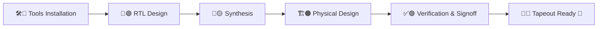

# RISC-V-SoC-Tapeout-Journey-From-RTL-Input-to-Silicon-Output

## 👋 Welcome

This repository documents **my personal journey through the RISC-V SoC Tapeout Program (VSD)**.
Here, I record my **week-by-week progress**, from setting up tools, to RTL design, to synthesis, physical design and finally preparing a **tapeout-ready SoC**.

> *“Learning to design a System-on-Chip (SoC) from basic RTL to GDSII using open-source tools, part of India’s largest collaborative RISC-V tapeout initiative, empowering 3500+ participants to build silicon and advance the nation’s semiconductor ecosystem.”*

 

  

 

## ⚡ Quick Access

<h3>

| Week | Title                        | Folder Link        |
| ---- | ---------------------------- | ------------------ |
| 0    | 🛠️ Foundation & Tools Setup | [Week 0](./week0/) |
| 1    | 🚀 (Coming Soon)             | [Week 1](./week1/) |
| 2    | 🔄 (Coming Soon)             | [Week 2](./week2/) |
| 3    | 🏗️ (Coming Soon)            | [Week 3](./week3/) |
| 4    | 🎯 (Coming Soon)             | [Week 4](./week4/) |

</h3>

 

## 🎯 Program Flow: From Idea → Silicon

## 🌟 Program Objectives & Scope

| Aspect                    | Details                                                                             |
| ------------------------- | ----------------------------------------------------------------------------------- |
| 🎓 **Learning Path**      | End-to-end SoC Design covering RTL → Synthesis → Physical Design → Tapeout          |
| 🛠️ **Tools Ecosystem**   | Open-source EDA stack (Icarus Verilog, GTKWave, Yosys, NGSpice, Magic & SCL180 PDK) |
| 🏭 **Industry Relevance** | Mimics real-world semiconductor design methodologies & tapeout flows                |
| 🤝 **Collaboration**      | Contributing alongside 3500+ participants in India’s largest RISC-V SoC initiative  |
| 🇮🇳 **National Impact**  | Strengthening India’s semiconductor design and VLSI ecosystem                       |

 

## 🛠️ Tools & Skills

 

<h2> 📅 Week 0 — Foundation & Tools Setup</h2>

 
  
Week 0 was all about **preparing the sandbox**: installing, verifying and configuring the open-source EDA environment that powers the RTL-to-GDSII flow.

* Installed and verified **Icarus Verilog**, **Yosys**, **GTKWave**, **ngspice**, **Magic**.
* Explored **environment setup** for RTL simulation and synthesis.
* Prepared my system for the upcoming **RTL → GDSII flow**.

### 🔗 **Access Week 0 Details**
- [Week 0 Folder](./week0/)

 

### 🔧 **Tasks Completed**

  
| Task  | Description                           | Tools Installed            | Status      |
| ----- | ------------------------------------- | -------------------------- | ----------- |
| **0** | Tool Installation & Environment Setup | Full Open-Source EDA Stack | ✅ Completed |

 

### 🛠️ **Installed Tools Overview**

  
| Tool               | Purpose                             | Status     |
| ------------------ | ----------------------------------- | ---------- |
| **Yosys**          | RTL synthesis & logic optimization  | ✅ Verified |
| **Icarus Verilog** | Functional simulation & compilation | ✅ Verified |
| **GTKWave**        | Waveform inspection & debugging     | ✅ Verified |
| **Ngspice**        | Analog & mixed-signal simulation    | ✅ Verified |
| **Magic VLSI**     | Layout design & DRC/LVS checks      | ✅ Verified |
  

 

**Key Learnings:**

✅ Got hands-on with open-source EDA tools.

✅ Understood how toolchains interact in the SoC design journey.

✅ Built a stable foundation for advanced tasks.

<h2>📅Week 1 — 🚀 (Coming Soon)</h2>

> ⚠️ Content coming soon!

### 🔗 **Access Week 1 Details**
- [Week 1 Folder](./week1/)

<h2>📅 Week 2 — 🔄 (Coming Soon) </h2>

> ⚠️ Content coming soon!

- [Week 2 Folder](./week2/)

<h2>📅 Week 3 — 🏗️ (Coming Soon)</h2>

    
> ⚠️ Content coming soon!
    
- [Week 3 Folder](./week3/)

<h2>📅 Week 4 — 🎯 (Coming Soon) </h2>

> ⚠️ Content coming soon!

- [Week 4 Folder](./week4/)

 

## 📌 Progress Tracker

 

## 📊 Activity Graph

 

## 🙏 **Acknowledgments**

### I am grateful to:

* [**Kunal Ghosh**](https://github.com/kunalg123) and the [**VLSI System Design (VSD) Team**](https://vsdiat.vlsisystemdesign.com/) for enabling this unique learning experience.
* [**RISC-V International**](https://riscv.org/), [**India Semiconductor Mission (ISM)**](https://ism.gov.in/), [**VLSI Society of India (VSI)**]([https://vsi.org.in/](https://www.linkedin.com/company/vlsi-society-of-india-vsi/posts/?feedView=all)) and [**Efabless**](https://chipfoundry.io/efabless) for supporting and driving this initiative.

 

## 🔗 Program Links

  
👉 The official portal for the VSD SoC Tapeout Program, where tasks, resources, and community discussions are hosted.  

  
👉 Home of the **RISC-V instruction set architecture**, providing open standards for CPUs used in this tapeout journey.  

 
👉 A community-driven platform for **open-source silicon design** and shuttle runs where our designs eventually get fabricated.  

 

## 👨‍💻 About Me

I am **Tushar Shenoy**, passionate about **VLSI design and semiconductor systems**. This repository is a **living record of my learning journey**, showing how I translate **academic concepts into industry practices** and ultimately into **real silicon implementations**. Beyond completing tasks, I focus on **understanding the “why” behind each step**, from setting up the environment to implementing architectures, running simulations and analyzing results. It reflects my progression from **student exploration to professional design workflows**, building a foundation for a career in **semiconductor technology and VLSI Design**.

📌 Follow along as I share weekly updates, technical insights, and project outcomes, the journey from code → circuits → chips continues… stay tuned! 🔥
