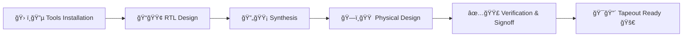

# RISC-V-SoC-Tapeout-Journey-From-RTL-Input-to-Silicon-Output

## 👋 Welcome

This repository documents **my personal journey through the RISC-V SoC Tapeout Program (VSD)**.
Here, I record my **week-by-week progress**, from setting up tools, to RTL design, to synthesis, physical design and finally preparing a **tapeout-ready SoC**.

> *“Learning to design a System-on-Chip (SoC) from basic RTL to GDSII using open-source tools — part of India’s largest collaborative RISC-V tapeout initiative, empowering 3500+ participants to build silicon and advance the nation’s semiconductor ecosystem.”*

 

## 🎯 Program Flow: From Idea → Silicon

## 🌟 Program Objectives & Scope

| Aspect                    | Details                                                                             |
| ------------------------- | ----------------------------------------------------------------------------------- |
| 🎓 **Learning Path**      | End-to-end SoC Design covering RTL → Synthesis → Physical Design → Tapeout          |
| 🛠️ **Tools Ecosystem**   | Open-source EDA stack (Icarus Verilog, Yosys, ngspice, OpenLane, Magic, SCL180 PDK) |
| 🏭 **Industry Relevance** | Mimics real-world semiconductor design methodologies & tapeout flows                |
| 🤝 **Collaboration**      | Contributing alongside 3500+ participants in India’s largest RISC-V SoC initiative  |
| 📈 **Scalability**        | Practical exposure to handling designs that scale from RTL to physical layout       |
| 🇮🇳 **National Impact**  | Strengthening India’s semiconductor design and VLSI ecosystem                       |

## 🛠️ Tools & Skills

 

 

## 📅 **Week 0 — Foundation & Tools Setup**

<b>🛠️ Week 0: Installing & Configuring the EDA Toolchain</b>

 
  
Week 0 was all about **preparing the sandbox**: installing, verifying and configuring the open-source EDA environment that powers the RTL-to-GDSII flow.

* Installed and verified **Icarus Verilog**, **Yosys**, **GTKWave**, **ngspice**, **Magic**.
* Explored **environment setup** for RTL simulation and synthesis.
* Prepared my system for the upcoming **RTL → GDSII flow**.

### 🔗 **Access Week 0 Details**
- [Week 0 Folder](./week0/)

 

### 🔧 **Tasks Completed**

| Task  | Description                           | Tools Installed            | Status      |
| ----- | ------------------------------------- | -------------------------- | ----------- |
| **0** | Tool Installation & Environment Setup | Full Open-Source EDA Stack | ✅ Completed |

 

### 🛠️ **Installed Tools Overview**

| Tool               | Purpose                             | Status     |
| ------------------ | ----------------------------------- | ---------- |
| **Yosys**          | RTL synthesis & logic optimization  | ✅ Verified |
| **Icarus Verilog** | Functional simulation & compilation | ✅ Verified |
| **GTKWave**        | Waveform inspection & debugging     | ✅ Verified |
| **Ngspice**        | Analog & mixed-signal simulation    | ✅ Verified |
| **Magic VLSI**     | Layout design & DRC/LVS checks      | ✅ Verified |

 

**Key Learnings:**

✅ Got hands-on with open-source EDA tools.

✅ Understood how toolchains interact in the SoC design journey.

✅ Built a stable foundation for advanced tasks.

 

## 📅 **Week 1 — 🚀 (Coming Soon)**

<b>🛠️ Week 1: </b>

> ⚠️ Content coming soon!

### 🔗 **Access Week 1 Details**
- [Week 1 Folder](./week1/)

 

## 📅 **Week 2 — 🔄 (Coming Soon)**

<b>🛠️ Week 2: </b>

> ⚠️ Content coming soon!

- [Week 2 Folder](./week2/)

 

## 📅 **Week 3 — 🏗️ (Coming Soon)**

<b>🛠️ Week 3: </b>

    
> ⚠️ Content coming soon!
    
- [Week 3 Folder](./week3/)

 

## 📅 **Week 4 — 🎯 T (Coming Soon)**

<b>🛠️ Week 4: </b>

> ⚠️ Content coming soon!

- [Week 4 Folder](./week4/)

 

## 📌 Progress Tracker

| Week | Activity        | Progress                                      |
| ---- | --------------- | --------------------------------------------- |
| 0    |   | 🟩🟩🟩🟩🟩🟩🟩🟩🟩🟩🟩🟩🟩🟩🟩🟩🟩🟩🟩🟩 100% |
| 1    |      | ⬜⬜⬜⬜⬜⬜⬜⬜⬜⬜⬜⬜⬜⬜⬜⬜⬜⬜⬜⬜ 0%                       |
| 2    |   | ⬜⬜⬜⬜⬜⬜⬜⬜⬜⬜⬜⬜⬜⬜⬜⬜⬜⬜⬜⬜ 0%                       |
| 3    |  | ⬜⬜⬜⬜⬜⬜⬜⬜⬜⬜⬜⬜⬜⬜⬜⬜⬜⬜⬜⬜ 0%                       |
| 4    |    | ⬜⬜⬜⬜⬜⬜⬜⬜⬜⬜⬜⬜⬜⬜⬜⬜⬜⬜⬜⬜ 0%                       |

 

## 📊 Activity Graph (Contributions)

 

## 🙏 **Acknowledgments**

### I am grateful to:

* [**Kunal Ghosh**](https://github.com/kunalg123) and the [**VLSI System Design (VSD) Team**](https://vsdiat.vlsisystemdesign.com/) for enabling this unique learning experience.
* [**RISC-V International**](https://riscv.org/), [**India Semiconductor Mission (ISM)**](https://ism.gov.in/), [**VLSI Society of India (VSI)**]([https://vsi.org.in/](https://www.linkedin.com/company/vlsi-society-of-india-vsi/posts/?feedView=all)) and [**Efabless**](Efabless) for supporting and driving this initiative.

 

## 🔗 Program Links

  
👉 The official portal for the VSD SoC Tapeout Program, where tasks, resources, and community discussions are hosted.  

  
👉 Home of the **RISC-V instruction set architecture**, providing open standards for CPUs used in this tapeout journey.  

  
👉 A community-driven platform for **open-source silicon design** and shuttle runs where our designs eventually get fabricated.  

 

## 👨‍💻 About Me

I am **Tushar Shenoy**, passionate about **VLSI design and semiconductor systems**.
This repository goes beyond simply completing weekly tasks, it is a **living record of my learning journey** in the world of chip design. Through this, I aim to capture the process of translating **academic concepts into industry practices** and eventually, into **real silicon implementations**.

The goal is not just to master tool installations or follow steps mechanically, but to **understand the “why” behind every stage**, from setting up the design environment to implementing architectures, running simulations and analyzing results.

In short, this repository reflects my transition from **student-level exploration → professional design methodologies → silicon-ready workflows**, building the foundation for a career in **semiconductor technology and RTL design**.

📌 Follow along as I share weekly updates, technical insights and project outcomes!

🔥 *Journey from code → circuits → chips continues… Stay tuned!*
