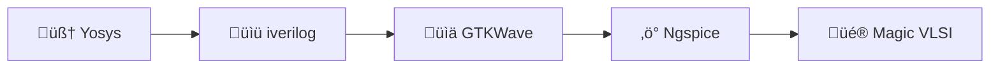

# 🛠️ Week 0: Tools Setup & Environment Foundation

<div align="center">


</div>


## 👋 Welcome

Week 0 marks the **start of my VLSI System Design (VSD) journey**. The main goal this week was to create a **stable, fully functional environment** for all VLSI design tasks, from **RTL coding** to **layout and simulation**.

> *“Before you can build chips, you need a rock-solid foundation, a system ready to handle synthesis, simulation and layout seamlessly.”*

<br>


## 🖥️ System Configuration

| Specification | Required      | My System                               |
| ------------- | ------------- | --------------------------------------- |
| 🐧 OS         | Ubuntu 20.04+ | Ubuntu 22.04.5 LTS                      | 
| 💾 RAM        | 6 GB          | 7.1 GB total (\~2.9 GB free)            | 
| 💿 Storage    | 50 GB HDD     | 214 GB NVMe (45 GB free)                | 
| ⚡ CPU         | 4 cores       | AMD Ryzen 5 4600H, 6 cores / 12 threads | 


<br>


## 🔗 Week 0 Quick Links

| Tool / Section         | Description                                         | Link                                             |
| ---------------------- | --------------------------------------------------- | ------------------------------------------------ |
| 🖥️ VLSI Tools Installation Script  | Script to Install whole setup           | [Go to Script](#vlsi-tools-installation)       |
| 🧠 Yosys               | RTL synthesis tool                                  | [Go to Yosys](#yosys)        |
| 📟 Icarus Verilog      | Compile & simulate Verilog HDL                      | [Go to iverilog](#iverilog)    |
| 📊 GTKWave             | Waveform viewer for Verilog simulations             | [Go to GTKWave](#gtkwave)       |
| ⚡ Ngspice              | Analog / mixed-signal circuit simulation            | [Go to Ngspice](#ngspice)      |
| 🎨 Magic VLSI          | Layout & DRC tool for IC design                     | [Go to Magic VLSI](#magic)          |
| 🖥️ How to Use ?| Full adder example simulation/synthesis with Icarus, GTKWave & yosys <br> Example of Ngspice and Magic| [Go to How to Use](#how-to-use) |


## ⚙️ Week 0 Tool Installation & Insights

This week, I installed **5 essential tools** for the VLSI workflow:




<h3 id="vlsi-tools-installation">🖥️ VLSI Tools Installation Script</h3>

<details>
<summary>Click to view description of VLSI Tools Installation Script</summary>
<br>
    
This repository provides a smart setup script for installing and verifying essential VLSI/EDA tools on Ubuntu 22.04.5 LTS. It ensures your environment is ready for **RTL design, simulation, waveform viewing, circuit simulation and layout design**.

## 🚀 Overview

The script, `toolinstallationscript.sh`, does the following:

1. Checks if the tool is already installed  
2. If installed → prints the current version  
3. If missing → installs the tool automatically  
4. Pauses between steps for verification and progress tracking  

**Tools handled by the script:**

| #️⃣ | Tool           | Purpose                                 |
| --- | -------------- | --------------------------------------- |
| 1️⃣ | Yosys          | RTL synthesis                           |
| 2️⃣ | Icarus Verilog | Verilog compilation & simulation        |
| 3️⃣ | GTKWave        | Waveform viewer for simulation outputs  |
| 4️⃣ | Ngspice        | Analog & mixed-signal circuit simulator |
| 5️⃣ | Magic VLSI     | Layout design and DRC tool              |

## ⚙️ Usage Instructions

### 1️⃣ Clone the repository (if using GitHub)

```bash
git clone https://github.com/tusharshenoy/RISC-V-SoC-Tapeout-Journey-From-RTL-Input-to-Silicon-Output.git
cd RISC-V-SoC-Tapeout-Journey-From-RTL-Input-to-Silicon-Output/
````

### 2️⃣ Make the script executable

```bash
chmod 777 toolinstallationscript.sh
```

### 3️⃣ Run the script

```bash
./toolinstallationscript.sh
```

* The script will pause after each tool for you to verify installation.
* Existing tools will not be reinstalled; their version will be printed.

## 📝 Notes & Tips

* Ensure **active internet connection** for cloning repositories and installing dependencies.
* **Yosys and Magic VLSI** are built from source, which may take several minutes depending on your CPU.
* Keep this script updated with new tools or updated versions for future VLSI projects.

## ✅ Verification

After running the script, you can verify each tool manually:

```bash
yosys -V
iverilog -v
gtkwave --version
ngspice -v
magic -version
```

</details>

<br>

<h2 id="yosys">1️⃣ Yosys – RTL Synthesis Tool</h2>

[](https://ubuntu.com/)
[](https://github.com/YosysHQ/yosys)
[](https://github.com/YosysHQ/yosys/blob/master/LICENSE)

### **Purpose:** Converts Verilog/VHDL RTL into a gate-level netlist, ready for further simulation or synthesis.

### **Installation Steps:**

```bash
git clone https://github.com/YosysHQ/yosys.git
cd yosys
sudo apt install make
sudo apt install make build-essential clang bison flex \
libreadline-dev gawk tcl-dev libffi-dev git \
graphviz xdot pkg-config python3 libboost-system-dev \
libboost-python-dev libboost-filesystem-dev zlib1g-dev
git submodule update --init --recursive
make config-gcc
make
sudo make install
```

### **Verification & Insights:**

* Run `yosys -V` to verify.
* Noted that missing dependencies can lead to obscure build errors — installing them upfront saves hours.


### 🛠️ Step-by-Step

Step-by-step process for setting up the **Yosys Open Synthesis Suite** from source on **Ubuntu Linux**, including dependencies, submodule handling, build instructions and troubleshooting tips.


### 📖 Overview

Yosys is an open-source framework for Verilog RTL synthesis. This guide ensures a smooth installation:

1. Clone the official repository  
2. Install build dependencies  
3. Initialize and update submodules  
4. Build Yosys  
5. Verify installation  


### 1️⃣ Cloning the Yosys Repository

Clone the repository using:

```bash
git clone https://github.com/YosysHQ/yosys.git
````


> This operation downloads the full codebase and history from the official upstream source (over 95,000 objects).


### 2️⃣ Installing Build Dependencies

Install all essential packages:

```bash
cd yosys
sudo apt install make
```


```bash
sudo apt install make build-essential clang bison flex \
libreadline-dev gawk tcl-dev libffi-dev git \
graphviz xdot pkg-config python3 libboost-system-dev \
libboost-python-dev libboost-filesystem-dev zlib1g-dev
```


> These packages provide compilers, linkers, parser generators, GUI tools and key libraries for Yosys.


### 3️⃣ Building Yosys

Build Yosys using **GNU Make**:

```bash
make config-gcc
make
```


> The build process compiles hundreds of modules across directories. If previous builds exist, it cleans old objects automatically.

<details>
<summary>⚠️ Optional: Clean before rebuilding</summary>

```bash
make clean
make config-gcc
make
```

> Useful if encountering unexpected build errors.

</details>


<details>
<summary> Troubleshooting Common Issues ❌ Submodule Errors</summary>

```bash
git submodule update --init
```

> Ensures `abc` and `cxxopts` are properly initialized, resolving build interruptions.


</details>


### 4️⃣ Verification

After building, verify Yosys:

```bash
yosys -V
```


> Should print the Yosys version without errors. Test with a simple Verilog file to confirm successful setup.


### 📝 Notes

* Verified for **Ubuntu 22.04.5 (September 2025)**
* Recommended to test example Verilog designs after installation
* Keep submodules up-to-date for new features or bug fixes

<br>

<h2 id="iverilog">2️⃣ iverilog – Verilog Simulation 🖥️</h2>

[](https://ubuntu.com/)
[](http://iverilog.icarus.com/)
[](http://iverilog.icarus.com/)

### **Purpose:** Compiles and simulates RTL designs for functional verification.

### 📖 Overview

iverilog allows compiling and simulating Verilog HDL designs efficiently. It is primarily used for:

- Functional verification of RTL modules  
- Catching syntax errors early  
- Running simple or complex testbenches  


### 1️⃣ Installing iverilog

Install iverilog using `apt`:

```bash
sudo apt-get update
sudo apt-get install iverilog
````


> Installs the compiler and simulator binaries required for Verilog simulation.


### 2️⃣ Verifying the Installation

Check the installed version:

```bash
iverilog -v
```


Expected output should display iverilog version information, confirming successful installation.

<details>
<summary>💡 Tip: Update iverilog</summary>

```bash
sudo apt-get update
sudo apt-get upgrade iverilog
```

> Ensures you are running the latest stable version available for Ubuntu.

</details>


### 📝 Notes

* Verified for **Ubuntu 22.04.5 (September 2025)**
* Ideal for learning, testing and small to medium-scale RTL projects
* Lightweight and faster than some commercial simulators

<br>


<h2 id="gtkwave">3️⃣ 🖥️ GTKWave – Waveform Viewer</h2>

[](https://ubuntu.com/)
[](http://gtkwave.sourceforge.net/)
[](http://www.gnu.org/licenses/)

### **Purpose:** GTKWave is a waveform viewer used to visualize **digital simulation outputs**, essential for debugging and verifying RTL designs.


### 📖 Overview

- Visualizes signals from `.vcd` files generated by simulators like iverilog.  
- Allows detailed inspection of **signal transitions, timing and logic behavior**.  
- Lightweight and widely used in digital design workflows.


### 1️⃣ Installation

```bash
sudo apt update
sudo apt install gtkwave
````


### 2️⃣ Verification

Launch GTKWave to verify installation:

```bash
gtkwave
```


> GUI should launch successfully, confirming proper installation.


### 📝 Notes

* Verified on **Ubuntu 22.04.5 (September 2025)**
* Complements **iverilog**, forming a complete digital simulation workflow.
* Lightweight, fast and easy to integrate into automated simulation scripts.

<br>

<h2 id="ngspice">4️⃣ 🖥️ Ngspice – Circuit Simulation</h2>

[](https://ubuntu.com/)
[](http://ngspice.sourceforge.net/)
[](http://www.gnu.org/licenses/)

### **Purpose:** Ngspice is an **open-source SPICE simulator** for analog and mixed-signal circuits, used for verifying voltage/current behavior before hardware implementation.

### 📖 Overview

- Performs **transient, AC, DC and mixed-signal analyses**.  
- Supports voltage/current plotting for analog/mixed-signal circuits.  
- Useful for testing **filters, amplifiers and analog sub-circuits**.


### 1️⃣ Installation

```bash
sudo apt update
sudo apt install ngspice
````


### 2️⃣ Verification

Check version to verify installation:

```bash
ngspice -v
```

<br>


> Should display Ngspice version information, confirming successful setup.


### 📝 Notes

* Verified on **Ubuntu 22.04.5 (September 2025)**
* Complements **digital simulation tools** like iverilog/GTKWave for full-system verification.
* Essential for analog/mixed-signal verification in VLSI workflows.

<br>

<h2 id="magic">5️⃣ 🖥️ Magic VLSI – Layout Tool</h2>

[](https://ubuntu.com/)
[](https://github.com/RTimothyEdwards/magic)
[](https://github.com/RTimothyEdwards/magic/blob/master/LICENSE)

### **Purpose:** Magic VLSI is an open-source **layout tool** used for designing, editing and verifying integrated circuit layouts.


### 📖 Overview

- Create and edit **IC layouts** interactively.  
- Perform **Design Rule Checks (DRC)** to ensure manufacturability.  
- Connects synthesized RTL to physical layout, forming a base for **Place & Route (PnR)** workflows.


### 1️⃣ Installation

Install required dependencies & Clone and build Magic:

```bash
sudo apt-get update
sudo apt-get install m4 tcsh csh libx11-dev tcl-dev tk-dev \
libcairo2-dev mesa-common-dev libglu1-mesa-dev libncurses-dev
git clone https://github.com/RTimothyEdwards/magic
cd magic
./configure
make
sudo make install
````


### 2️⃣ Verification

* Run `magic` to open GUI.
* Learned about **layout editing, cell creation and design rule checks**.
* Observed how layout design correlates with synthesized RTL, laying the groundwork for PnR.

```bash
magic
```

<br>


> GUI should launch successfully, allowing interactive layout editing.


### 📝 Notes

* Verified on **Ubuntu 22.04.5 (September 2025)**
* Essential for **VLSI physical design education** and hands-on layout practice.
* Forms a foundation for **advanced PnR tools** and layout-aware verification workflows.

<br>

## 🎉 Week 0 Summary & Key Learnings

| Tool          | Status      | Purpose            | Key Insight                                       |
| ------------- | ----------- | ------------------ | ------------------------------------------------- |
| 🧠 Yosys      | ✅ Installed | RTL Synthesis      | Learned importance of dependencies and submodules |
| 📟 iverilog   | ✅ Installed | Simulation         | Early bug detection via functional simulation     |
| 📊 GTKWave    | ✅ Installed | Waveform Analysis  | Visual signal debugging enhances understanding    |
| ⚡ Ngspice     | ✅ Installed | Circuit Simulation | Analog/mixed-signal verification                  |
| 🎨 Magic VLSI | ✅ Installed | Layout Design      | Understanding of DRC and layout flow              |

<br>

<h2 id="how-to-use">🖥️ How to Use ?</h2>

### 🖥️ Full Adder Example Simulation & Synthesis

This demonstrates a **full adder design workflow** using **Icarus Verilog, GTKWave and Yosys** for digital simulation and synthesis.  
Verilog files are inside the `Verilog Simulation` folder, while analog examples using Ngspice are in `Spice Simulation`.

<details>
<summary>1️⃣ Verilog Simulation (Icarus & GTKWave)</summary>

<br>

Files in `Verilog Simulation`:

* `full_adder.v` – Full adder module
* `full_adder_tb.v` – Testbench for the full adder
* `full_adder.vcd` – Generated waveform file

**Simulation Steps:**

1. **Compile the Verilog files:**

```bash
iverilog -o full_adder_wave full_adder.v full_adder_tb.v
````

2. **Run the simulation:**

```bash
vvp full_adder_wave
```

This generates the `full_adder.vcd` waveform file.

3. **View waveforms with GTKWave:**

```bash
gtkwave full_adder.vcd
```


> Notes:
> * Ensure **Icarus Verilog** and **GTKWave** are installed.
> * You can replace the module and testbench with other designs for a similar simulation workflow.
> * Zoom, pan and inspect signal transitions to catch design errors early.
> * Ideal for visual debugging and confirming correctness of RTL modules.


<br>

💡 Tip: Use keyboard shortcuts</summary>

* `Ctrl+F` – Find signals
* `Ctrl+G` – Go to time marker
* `Ctrl+S` – Save waveform configuration


</details>


<details>
    
<summary>2️⃣ RTL Synthesis with Yosys</summary>
<br>

Files in `Verilog Simulation` (same folder):

* `full_adder.v` – Full adder module

**Synthesis Steps:**

```bash
yosys
```


Inside Yosys console:

```yosys
read_verilog full_adder.v
synth -top full_adder
show
write_json full_adder.json
```


> * `show` opens a graphical netlist view.
> * `write_json` generates a netlist file for further use in backend flows.

</details>

<details>
<summary>3️⃣ Ngspice – SPICE Simulation</summary>
<br>
    
Files in `Spice Simulation`:

* Simple resistor circuit examples (`circuit.sp`)

**Usage & Insights:**

* Run a simple SPICE simulation:

```spice
* Simple resistor circuit
V1 1 0 0            ; Voltage source (value will be swept)
R1 1 0 10k          ; Resistor of 10k ohm

.dc V1 0 10 1         ; Sweep V1 from 0V to 10V in steps of 1V
.print dc V(1,0) I(V1) ; Print voltage and current

.end
```

```bash
ngspice circuit.sp
```


or

```bash
ngspice -b circuit.sp
```


```bash
run
print V(1) I(V1)
```


```bash
plot I(V1)
```


```bash
plot V(1) I(V1)
```


<br>
<details>
    <br>
<summary>💡 Tip: Use interactive plotting in Ngspice</summary>

* Plot voltage/current waveforms to inspect circuit behavior.  
* Helps identify analog design issues **before fabrication**.  
* Interactive commands allow **zooming, tracing, and analyzing signals** in Ngspice:

</details>

<br>

✅ **Week 0 Takeaways:**

* Built a **reliable toolchain** for the full VLSI workflow.
* Understood the **roles of synthesis, simulation, waveform viewing, circuit simulation, and layout**.
* Verified each tool **practically** by:
  * **Simulating** RTL designs using Icarus Verilog and GTKWave
  * **Synthesizing** designs with Yosys
  * **Plotting** signals and verifying behavior in Ngspice
  * Exploring **layout and DRC** in Magic VLSI
* Prepared my system to **transition seamlessly into RTL design next week**, confident that all tools are fully operational.


<br>


## Author & Repository

**Author:** T Tushar Shenoy

**Repository:** [RISC-V-SoC-Tapeout-Journey-From-RTL-Input-to-Silicon-Output](https://github.com/tusharshenoy/RISC-V-SoC-Tapeout-Journey-From-RTL-Input-to-Silicon-Output)

**Program:** VLSI System Design (VSD)

> 💡 Next week: Yet to be Started


