# 🚀 Week 0: Tools Setup & Environment Foundation

<div align="center">


</div>


## 👋 Welcome

Week 0 marks the **start of my VLSI System Design (VSD) journey**. The main goal this week was to create a **stable, fully functional environment** for all VLSI design tasks – from **RTL coding** to **layout and simulation**.

> *“Before you can build chips, you need a rock-solid foundation, a system ready to handle synthesis, simulation and layout seamlessly.”*

<br>


## 🖥️ System Configuration

I’m running a **native Ubuntu 22.04.5 LTS system**, optimized for VLSI/EDA tools.

| Specification | Required      | My System                               | Why It Matters                                                          |
| ------------- | ------------- | --------------------------------------- | ----------------------------------------------------------------------- |
| 🐧 OS         | Ubuntu 20.04+ | Ubuntu 22.04.5 LTS                      | Most open-source VLSI tools are tested on Linux, ensures compatibility. |
| 💾 RAM        | 6 GB          | 7.1 GB total (\~2.9 GB free)            | Enough to handle synthesis and simulation tasks without lag.            |
| 💿 Storage    | 50 GB HDD     | 214 GB NVMe (45 GB free)                | Stores tools, source files, and simulation results.                     |
| ⚡ CPU         | 4 cores       | AMD Ryzen 5 4600H, 6 cores / 12 threads | Multi-threaded compilation and synthesis speed up RTL processing.       |

💡 **Insight:** Native OS + NVMe storage and multi-threaded CPU ensures fast simulation, synthesis and GUI performance for tools like GTKWave, Magic VLSI and OpenROAD.

<br>

## ⚙️ Week 0 Tool Installation & Insights

This week, I installed **5 essential tools** for the VLSI workflow:

```mermaid
flowchart LR
    Y[🧠 Yosys] --> I[📟 Iverilog] --> G[📊 GTKWave]
    G --> N[⚡ Ngspice] --> M[🎨 Magic VLSI]
```



<br>

### 1️⃣ Yosys – RTL Synthesis Tool

**Purpose:** Converts Verilog/VHDL RTL into a gate-level netlist, ready for further simulation or synthesis.

**Installation Steps:**

```bash
git clone https://github.com/YosysHQ/yosys.git
cd yosys
sudo apt install make build-essential clang bison flex \
libreadline-dev gawk tcl-dev libffi-dev git \
graphviz xdot pkg-config python3 libboost-system-dev \
libboost-python-dev libboost-filesystem-dev zlib1g-dev
git submodule update --init --recursive
make config-gcc
make
sudo make install
```

**Verification & Insights:**

* Run `yosys -V` to verify.
* Learned how **dependencies like ABC submodule** are essential for successful synthesis.
* Noted that missing dependencies can lead to obscure build errors — installing them upfront saves hours.

<br>

### 2️⃣ Iverilog – Verilog Simulation

**Purpose:** Compiles and simulates RTL designs for functional verification.

```bash
sudo apt-get install iverilog
```

**Verification & Insights:**

* Run `iverilog -v`.
* I realized **simple syntax mistakes in RTL** show up clearly, helping catch bugs early.

<br>

### 3️⃣ GTKWave – Waveform Viewer

**Purpose:** Visualizes simulation waveforms to debug RTL behavior.

```bash
sudo apt install gtkwave
```

**Verification & Insights:**

* Run `gtkwave` to check GUI launch.
* Useful for visually inspecting signal transitions and confirming design correctness.

<br>

### 4️⃣ Ngspice – Circuit Simulation

**Purpose:** Simulates analog or mixed-signal circuits.

```bash
sudo apt install ngspice
```

**Verification & Insights:**

* Run `ngspice -v`.
* Learned about **plotting voltage/current waveforms**, essential for analog/mixed-signal verification.

<br>

### 5️⃣ Magic VLSI – Layout Tool

**Purpose:** Layout creation, editing, and DRC checking.

```bash
sudo apt-get install m4 tcsh csh libx11-dev tcl-dev tk-dev \
libcairo2-dev mesa-common-dev libglu1-mesa-dev libncurses-dev
git clone https://github.com/RTimothyEdwards/magic
cd magic
./configure
make
sudo make install
```

**Verification & Insights:**

* Run `magic` to open GUI.
* Learned about **layout editing, cell creation, and design rule checks**.
* Observed how layout design correlates with synthesized RTL, laying the groundwork for PnR.

<br>

## 🎉 Week 0 Summary & Key Learnings

| Tool          | Status      | Purpose            | Key Insight                                       |
| ------------- | ----------- | ------------------ | ------------------------------------------------- |
| 🧠 Yosys      | ✅ Installed | RTL Synthesis      | Learned importance of dependencies and submodules |
| 📟 Iverilog   | ✅ Installed | Simulation         | Early bug detection via functional simulation     |
| 📊 GTKWave    | ✅ Installed | Waveform Analysis  | Visual signal debugging enhances understanding    |
| ⚡ Ngspice     | ✅ Installed | Circuit Simulation | Analog/mixed-signal verification                  |
| 🎨 Magic VLSI | ✅ Installed | Layout Design      | Understanding of DRC and layout flow              |

✅ **Week 0 Takeaways:**

* Built a **reliable toolchain** for full VLSI workflow.
* Understood **roles of synthesis, simulation, waveform viewing, and layout**.
* Prepared my system to **transition seamlessly into RTL design next week**.

<br>

## 👨‍💻 Author & Repository

**Author:** T Tushar Shenoy

**Repository:** RISC-V-SoC-Tapeout-Journey-From-RTL-Input-to-Silicon-Output

**Program:** VLSI System Design (VSD)

> 💡 Next week: Begin **RTL design** and turn concepts into synthesizable Verilog code, ready for simulation and verification.
